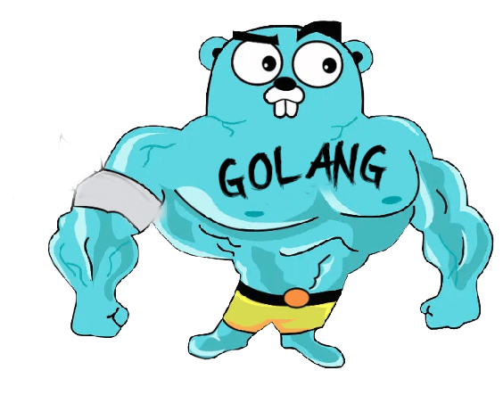

<h4 align="right">QR code to My Resume</h4>

<h1>Hi , I'm Mirsaid</h1>
<h3>Back End developer in Uzbekistan</h3>

<a href="https://github.com/theMir8">
    

 
    

- 💻 Core Stack: Python, Golang

- 🌱 I’m currently learning Web Development Technologies in Backend Golang + Graphql, Golang + Python/Django and Databases (PostgreSql).

<!-- - 💬 Ask me about **Python, Django or any tech related stuff**

🚀 Some of my main projects:

 
 
 -  🔭 I’m currently working on a Projects in Django and another Project with Golang and Postgresql: 

 

 -->

<h1> 📫 Connect with me: </h1>

<h1>💻 Languages and Tools:</h1>

	
	
	
	
	
	
	
	
	

